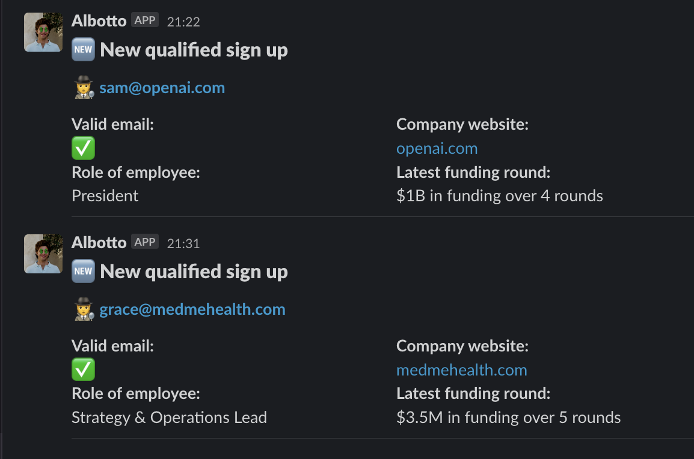

# Qualify new sign ups and send a Slack notification with their information

## What is this?

Receive notifications in Slack like this:

## How to use

1. Create an [OpenAI API](https://openai.com/api/) key and save it your environment variables as `OPENAI_API_KEY` - See (`.env.example`)[.env.example] for an example.
2. Create a slack bot with a webhook to post a message to a channel. See [this](https://api.slack.com/messaging/webhooks) for more info.
3. Run `pip install -r requirements.txt` to install the dependencies.
4. Run `./main.py email@example.com` to run the script.
5. Receive a slack message with the answer to your questions

You can add more questions you want to ask

## Credits

The crawler code is almost entirely based on [this](https://github.com/nat/natbot/blob/main/natbot.py). Just focused on answering answering specific questions using Google and with easier to install dependencies.
